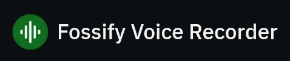
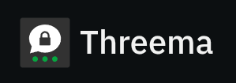

# 📝 Android apps suggestions
Clicking on the images will redirect you to their respective release source pages

Password manager

Web browser

Calendar

Contact manager

Photo manager

Audio player

Note-taking tool

Digital painting tool

Audio recorder

Keyboard

Video streaming

Photo manager

Note-taking tool

Torrent client

VPN service

App store

GPS navigation service

Anti-spam tool

File sync tool

Instant messenger

Webmail provider

Media player

# 🦾 Settings Suggestions

- [GrapheneOS Overview](grapheneOS/README.md) & [GrapheneOS Settings](grapheneOS/gOS_settings.md)
- [Futo Keyboard Settings](futo-keyboard/README.md)
- [Grayjay Settings](grayjay/README.md)
- [Brave Settings](brave/README.md)
